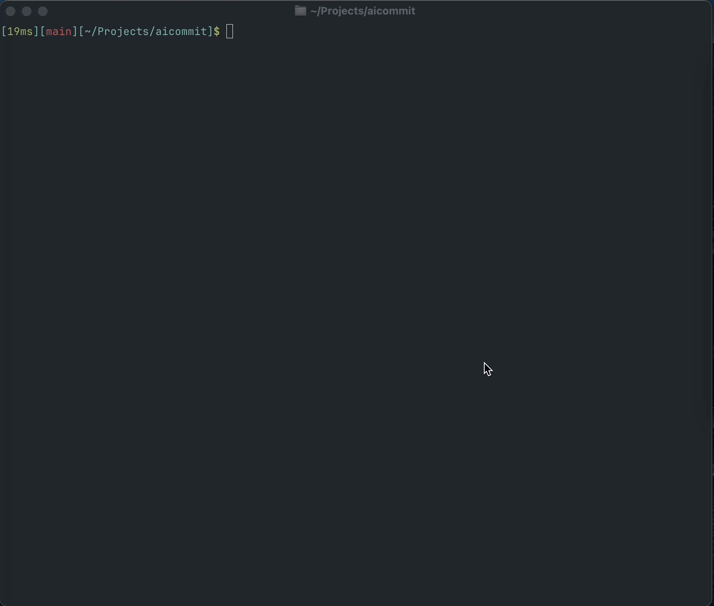

# aicommit

`aicommit` is an AI-powered git commit message generator.



## Installation

### Using Homebrew (macOS and Linux)

```bash
# Install from Homebrew tap
brew install mingeme/tap/aicommit
```

### From Source

```bash
# Clone the repository
git clone https://github.com/mingeme/aicommit.git
cd aicommit

# Install dependencies
pnpm install

# Build the project
pnpm run build

# Link the CLI tool globally
pnpm link
```

## Development

```bash
# Run in development mode
pnpm run dev

# Build the project
pnpm run build

# Run tests
pnpm test
```

## Usage

```bash
# Show help
aicommit --help

# Generate a commit message and create a commit
aicommit

# Generate a commit message without creating a commit (dry-run mode)
aicommit --dry-run
# or
aicommit -d

# Authenticate with a provider
aicommit auth add <provider> <apiKey>
# or
aicommit auth use <provider>

# Manage prompt configurations
aicommit prompt init        # Create a default prompt configuration in current directory
aicommit prompt init --global  # Create a default prompt configuration in global config directory
aicommit prompt show        # Show current prompt configuration
```

### Options

- `-d, --dry-run`: Generate a commit message without creating a commit
- `auth add <provider> <apiKey>`: Add a new provider configuration
- `auth use <provider>`: Set the current provider
- `prompt init`: Create a new prompt configuration file
- `prompt show`: Show current prompt configuration
- `-h, --help`: Display help information

## Customizing Prompts

You can customize the prompts used for generating commit messages by creating a `.aicommit.md` file either in your current working directory or in the global config directory (`~/.config/aicommit/`).

The file should have the following format:

```markdown
# System Prompt

Your custom system prompt here

# User Prompt Template

Your custom user prompt template here

{{diff}}
```

The `{{diff}}` placeholder will be replaced with the actual git diff content.

## License

MIT
